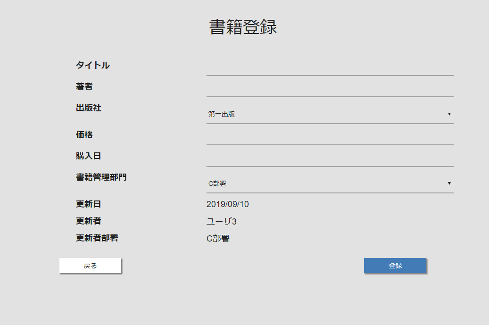

# 書籍登録画面

## 概要

書籍の新規登録を行う。

## 画面イメージ

## 画面項目

| 項目名       | タイプ         | 取得元/保存先             | 備考 |
| :----------- | :------------- | :------------------------ | :--- |
| タイトル     | テキスト       | -                         | -    |
| 著者         | テキスト       | -                         |      |
| 出版社       | テキスト       | 出版社取得API             | -    |
| 価格         | テキスト       | -                         | -    |
| 購入日       | テキスト       | -                         | -    |
| 書籍管理部署 | ドロップダウン | 部署情報取得API           | -    |
| 更新日       | ラベル         | 当日日付                  | -    |
| 更新者       | ラベル         | ログイン情報.ユーザ名     | -    |
| 更新者部署   | ラベル         | ログイン情報.ユーザ部署名 | -    |
| 戻る         | ボタン         | -                         | -    |
| 登録         | ボタン         | -                         | -    |

## アクション

### 初期表示時

1. 出版社取得APIをコールし、取得した出版社の情報を出版社ドロップダウンに表示する。
2. 部署情報取得APIをコールし、取得した部署の情報を書籍管理部署APIに表示する。
3. セッションからログインユーザ情報を取得し、画面の各項目に表示する。

### 戻るボタン押下時

1. [書籍一覧画面](list.md)に遷移する。

### 登録ボタン押下時

1. 入力チェックを実施する
   1. 【入力エラーがある場合】
      1. エラーの内容を画面に表示し、以降のイベント処理を中断する。
2. 確認ダイアログを表示する。「登録します。よろしいですか？」
   1. 【「はい」以外が選択された場合】
      1. 以降のイベント処理を中断する。
3.  画面の入力項目から書籍登録APIを呼び出し、登録処理を行う。
   2. 【APIのエラーが返却された場合】
      1. メッセージ「サーバにてエラーが発生しました。」を表示し、以降のイベント処理を中断する。
4. メッセージ「登録に成功しました。」を表示する。
5. [書籍詳細画面](detail.md)に遷移する。

## 使用API

[書籍情報API / 書籍の登録または更新)](https://bookmanagementapi.docs.apiary.io/#reference/0/4/1)

[出版社取得 / 出版社一覧取得](https://bookmanagementapi.docs.apiary.io/#reference/0/0)

[部署情報取得 / 部署一覧取得](https://bookmanagementapi.docs.apiary.io/#reference/0/3/0)